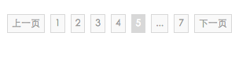

# jq-paging
 pagination for jQuery 
 分页组件
## UI展示
 - 具体图如下：    
   总条数，当前页之类提示在左边：  
       
   总条数，当前页之类提示在右边：   
       
   无提示：  
     
   
## 使用
 - 使用时，应指定在何处插入分页，即传入root对应的选择器，配置项如下：
 
 ```
       /**
        * 当前页
        * */
       currentPage:1,
       /**
        * 每页展示条目数量
        * */
       pageSize:5,
       /**
        * 总条目数量
        * */
       total:20,
       /**
        * 分页标签显示个数
        * */
       showNum: 5,
       /**
        * 插入分页的元素标记
        * */
       root:'#pages',
       /**
        * 是否显示提示,默认显示
        * */
           showTip: true,
       /**
        * tip是否显示在左边，true为左false为右，默认为true
        * */
           leftTip: true,
       /**
        * 点击回调事件
        * 返回参数为要显示的页数
        * */
       clickCallBack: function(num){
   
       },
       /**
        * 动态改变配置项参数
        * */
       setOpts:function(opts){},
       /**
         * 是否同步分页，即通过url整体刷新即后端分页
         * */
           isLink: false,
         /**
          * 配置link参数
          * */
         linkOpts:{
           /**
            * 基本url,不指定默认location.href
            * */
            baseUrl:location.href,
            /**
             * 每次需要根据页数改变的key
             * 例如page = 1 每次更改page。
             * */
            key:'page'
           }
       
 ```
 使用实例：
 js:
 
 ```
 
    import { Paging } from '../../src/index.js';
    (()=>{
       new Paging({
          pageSize:5,
          total:203,
          showNum:9,
          root:'#pages',
          clickCallBack:function(num){
             console.log('第'+num+'页');
          }
       });
    })();
    //实例化后更改配置项
    let a = Paging({
          pageSize:5,
          total:192,
          showNum:5,
          showTip:true,
          leftTip:false,
          clickCallBack:function(num){
             location.hash = num;
             console.log('第'+num+'页');
          }
       });
      a.setOpts({
        pageSize:6,
        total:40,
        showNum:5,
        clickCallBack:function(num){
            console.log('第'+num+'页2');
        }
      });  
      
 ```
 html:
 
 ```
 
    <div id="root" style="padding: 10px">
        <div id="pages" class="jq-pages"></div>
    </div>
    
 ```
 - 注：若要兼容ie8及以下版本请引入es5-shim。    
   在html中判断版本，ie9以下引入。例如：    
  
  ```
     <!--[if lt IE 9] >
     <script src="http://cdn.bootcss.com/es5-shim/4.5.9/es5-shim.js"></script>
     <!--[endif]-->
  
  ```
## update

   - 0.1.12 新增方法支持后端分页，即配置不同url进行跳转。不通过ajax
   - 0.1.11 修复临界值bug
   - 0.1.10 更新setOpts之后分页的bug
   - 之前版本 init及修复 

## Command

```
	#测试	
	npm run test	
	#打包	
	npm run build	
	#例子演示	
	npm run demo	
```
